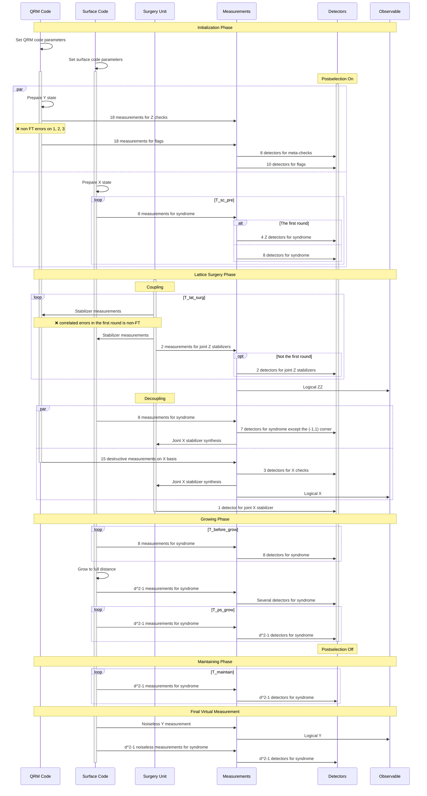

```mermaid
sequenceDiagram
    participant A as QRM Code
    participant B as Surface Code
    participant S as Surgery Unit
    participant M as Measurements
    participant D as Detectors
    participant O as Observable

    Note over A, O: Initialization Phase
    
    A->>A: Set QRM code parameters
    B->>B: Set surface code parameters
    
    activate A
    activate B
    Note over D: Postselection On
    activate D
    par 
        A->>A: Prepare Y state
        A->>M: 18 measurements for Z checks
        Note over A: ❌ non FT errors on 1, 2, 3
        A->>M: 18 measurements for flags
        M->>D: 8 detectors for meta-checks
        M->>D: 10 detectors for flags
    and
        B->>B: Prepare X state
        loop T_sc_pre 
            B->>M: 8 measurements for syndrome
            alt The first round
                M->>D: 4 Z detectors for syndrome
            else
                M->>D: 8 detectors for syndrome
            end
        end
    end

    Note over A, O: Lattice Surgery Phase

    activate S
    Note over S: Coupling
    loop T_lat_surg
        S->>A: Stabilizer measurements
        Note over A, S: ❌ correlated errors in the first round is non-FT
        S->>B: Stabilizer measurements
        S->>M: 2 measurements for joint Z stabilizers
        opt Not the first round
            M->>D: 2 detectors for joint Z stabilizers  
        end
    end
    M->>O: Logical ZZ
    Note over S: Decoupling
    par
        B->>M: 8 measurements for syndrome
        M->>D: 7 detectors for syndrome except the (-1,1) corner
        M->>S: Joint X stabilizer synthesis
    and
        A->>M: 15 destructive measurements on X basis
        deactivate A
        M->>D: 3 detectors for X checks
        M->>S: Joint X stabilizer synthesis
        M->>O: Logical X
    end
    S->>D: 1 detector for joint X stabilizer
    deactivate S

    Note over A, O: Growing Phase
    loop T_before_grow
        B->>M: 8 measurements for syndrome
        M->>D: 8 detectors for syndrome
    end
    B->>B: Grow to full distance
    B->>M: d^2-1 measurements for syndrome
    M->>D: Several detectors for syndrome
    loop T_ps_grow
        B->>M: d^2-1 measurements for syndrome
        M->>D: d^2-1 detectors for syndrome
    end

    deactivate D
    Note over D: Postselection Off

    Note over A, O: Maintaining Phase
    loop T_maintain
        B->>M: d^2-1 measurements for syndrome
        M->>D: d^2-1 detectors for syndrome
    end

    Note over A, O: Final Virtual Measurement
    B->>M: Noiseless Y measurement
    M->>O: Logical Y
    B->>M: d^2-1 noiseless measurements for syndrome
    M->>D: d^2-1 detectors for syndrome

    deactivate B
```