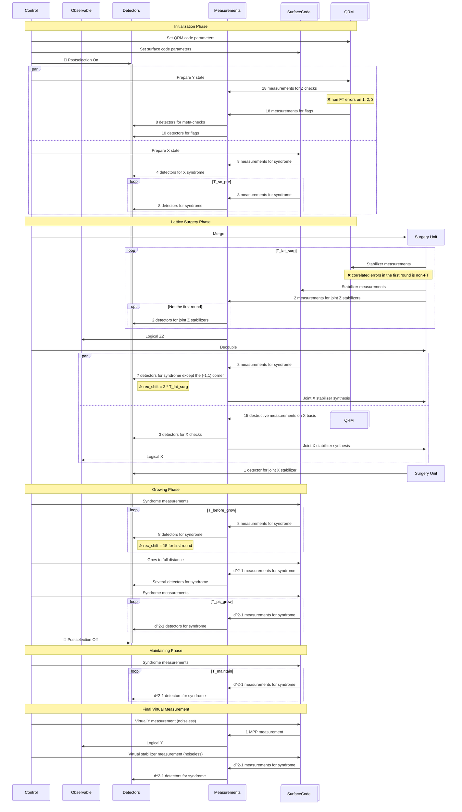
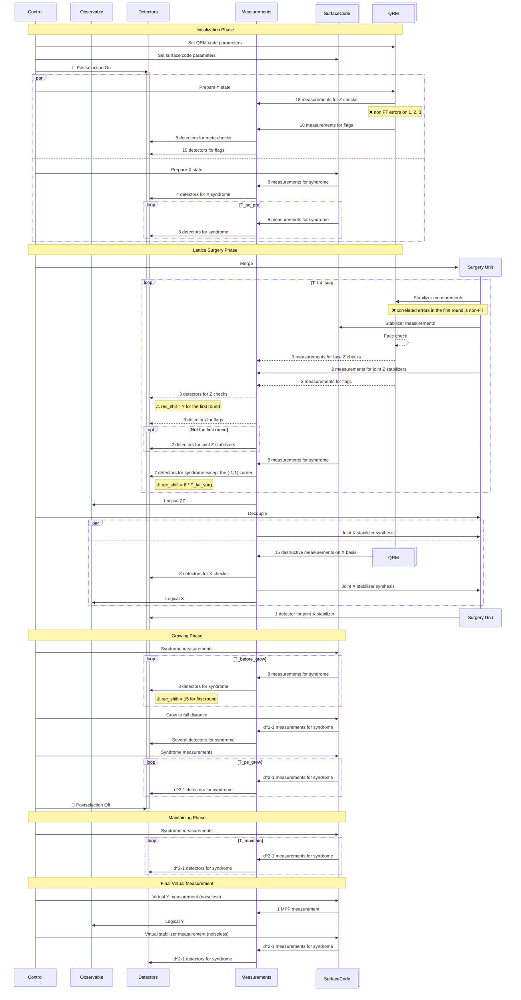

## The non-FT version

```mermaid
sequenceDiagram
    participant C as Control
    participant O as Observable
    participant D as Detectors
    participant M as Measurements
    participant SurfaceCode@{ "type" : "collections" }
    participant QRM@{ "type" : "collections" }

    Note over C, QRM: Initialization Phase
    
    C->>QRM: Set QRM code parameters
    C->>SurfaceCode: Set surface code parameters
    
    C->>D: 🔘 Postselection On
    activate D
    par 
        C->>QRM: Prepare Y state
        QRM->>M: 18 measurements for Z checks
        Note over QRM: ❌ non FT errors on 1, 2, 3
        QRM->>M: 18 measurements for flags
        M->>D: 8 detectors for meta-checks
        M->>D: 10 detectors for flags
    and
        C->>SurfaceCode: Prepare X state
        SurfaceCode->>M: 8 measurements for syndrome
        M->>D: 4 detectors for X syndrome
        loop T_sc_pre 
            SurfaceCode->>M: 8 measurements for syndrome
            M->>D: 8 detectors for syndrome
        end
    end

    Note over C, QRM: Lattice Surgery Phase

    create participant S as Surgery Unit
    C->>S: Merge
    loop T_lat_surg
        S->>QRM: Stabilizer measurements
        Note over QRM, S: ❌ correlated errors in the first round is non-FT
        S->>SurfaceCode: Stabilizer measurements
        S->>M: 2 measurements for joint Z stabilizers
        opt Not the first round
            M->>D: 2 detectors for joint Z stabilizers  
        end
    end
    M->>O: Logical ZZ

    C->>S: Decouple
    par
        SurfaceCode->>M: 8 measurements for syndrome
        M->>D: 7 detectors for syndrome except the (-1,1) corner
        Note right of D: ⚠️ rec_shift = 2 * T_lat_surg
        M->>S: Joint X stabilizer synthesis
    and
        destroy QRM
        QRM->>M: 15 destructive measurements on X basis
        M->>D: 3 detectors for X checks
        M->>S: Joint X stabilizer synthesis
        M->>O: Logical X
    end
    destroy S
    S->>D: 1 detector for joint X stabilizer

    Note over C, SurfaceCode: Growing Phase
    C->>SurfaceCode: Syndrome measurements
    loop T_before_grow
        SurfaceCode->>M: 8 measurements for syndrome
        M->>D: 8 detectors for syndrome
        Note right of D: ⚠️ rec_shift = 15 for first round
    end
    C->>SurfaceCode: Grow to full distance
    SurfaceCode->>M: d^2-1 measurements for syndrome
    M->>D: Several detectors for syndrome
    C->>SurfaceCode: Syndrome measurements
    loop T_ps_grow
        SurfaceCode->>M: d^2-1 measurements for syndrome
        M->>D: d^2-1 detectors for syndrome
    end

    C->>D: 🔘 Postselection Off
    deactivate D

    Note over C, SurfaceCode: Maintaining Phase
    C->>SurfaceCode: Syndrome measurements
    loop T_maintain
        SurfaceCode->>M: d^2-1 measurements for syndrome
        M->>D: d^2-1 detectors for syndrome
    end

    Note over C, SurfaceCode: Final Virtual Measurement
    C->>SurfaceCode: Virtual Y measurement (noiseless)
    SurfaceCode->>M: 1 MPP measurement
    M->>O: Logical Y
    C->>SurfaceCode: Virtual stabilizer measurement (noiseless)
    SurfaceCode->>M: d^2-1 measurements for syndrome
    M->>D: d^2-1 detectors for syndrome
```

## Face-check version

```mermaid
sequenceDiagram
    participant C as Control
    participant O as Observable
    participant D as Detectors
    participant M as Measurements
    participant SurfaceCode@{ "type" : "collections" }
    participant QRM@{ "type" : "collections" }

    Note over C, QRM: Initialization Phase
    
    C->>QRM: Set QRM code parameters
    C->>SurfaceCode: Set surface code parameters
    
    C->>D: 🔘 Postselection On
    activate D
    par 
        C->>QRM: Prepare Y state
        QRM->>M: 18 measurements for Z checks
        Note over QRM: ❌ non FT errors on 1, 2, 3
        QRM->>M: 18 measurements for flags
        M->>D: 8 detectors for meta-checks
        M->>D: 10 detectors for flags
    and
        C->>SurfaceCode: Prepare X state
        SurfaceCode->>M: 8 measurements for syndrome
        M->>D: 4 detectors for X syndrome
        loop T_sc_pre 
            SurfaceCode->>M: 8 measurements for syndrome
            M->>D: 8 detectors for syndrome
        end
    end

    Note over C, QRM: Lattice Surgery Phase

    create participant S as Surgery Unit
    C->>S: Merge
    loop T_lat_surg
        S->>QRM: Stabilizer measurements
        Note over QRM, S: ❌ correlated errors in the first round is non-FT
        S->>SurfaceCode: Stabilizer measurements
        QRM-->>QRM: Face check
        QRM-->>M: 3 measurements for face Z checks
        S->>M: 2 measurements for joint Z stabilizers
        QRM-->>M: 3 measurements for flags
        M-->>D: 3 detectors for Z checks
        note right of D: ⚠️ rec_shit = ? for the first round
        M-->>D: 3 detectors for flags
        opt Not the first round
            M->>D: 2 detectors for joint Z stabilizers  
        end
        SurfaceCode->>M: 8 measurements for syndrome
        M->>D: 7 detectors for syndrome except the (-1,1) corner
        Note right of D: ⚠️ rec_shift = 8 * T_lat_surg
    end
    M->>O: Logical ZZ

    C->>S: Decouple
    par
        M->>S: Joint X stabilizer synthesis
    and
        destroy QRM
        QRM->>M: 15 destructive measurements on X basis
        M->>D: 3 detectors for X checks
        M->>S: Joint X stabilizer synthesis
        M->>O: Logical X
    end
    destroy S
    S->>D: 1 detector for joint X stabilizer

    Note over C, SurfaceCode: Growing Phase
    C->>SurfaceCode: Syndrome measurements
    loop T_before_grow
        SurfaceCode->>M: 8 measurements for syndrome
        M->>D: 8 detectors for syndrome
        Note right of D: ⚠️ rec_shift = 15 for first round
    end
    C->>SurfaceCode: Grow to full distance
    SurfaceCode->>M: d^2-1 measurements for syndrome
    M->>D: Several detectors for syndrome
    C->>SurfaceCode: Syndrome measurements
    loop T_ps_grow
        SurfaceCode->>M: d^2-1 measurements for syndrome
        M->>D: d^2-1 detectors for syndrome
    end

    C->>D: 🔘 Postselection Off
    deactivate D

    Note over C, SurfaceCode: Maintaining Phase
    C->>SurfaceCode: Syndrome measurements
    loop T_maintain
        SurfaceCode->>M: d^2-1 measurements for syndrome
        M->>D: d^2-1 detectors for syndrome
    end

    Note over C, SurfaceCode: Final Virtual Measurement
    C->>SurfaceCode: Virtual Y measurement (noiseless)
    SurfaceCode->>M: 1 MPP measurement
    M->>O: Logical Y
    C->>SurfaceCode: Virtual stabilizer measurement (noiseless)
    SurfaceCode->>M: d^2-1 measurements for syndrome
    M->>D: d^2-1 detectors for syndrome
```

should measure Z checks of surface code during surgery